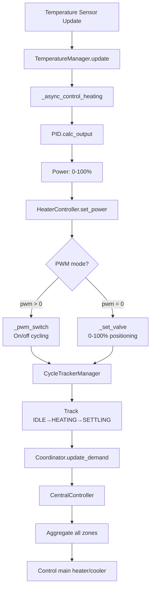
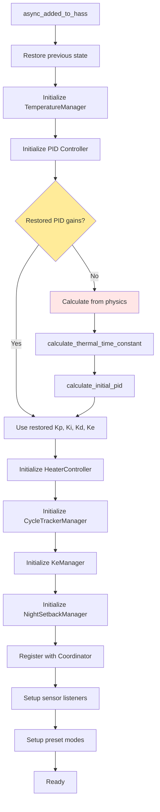
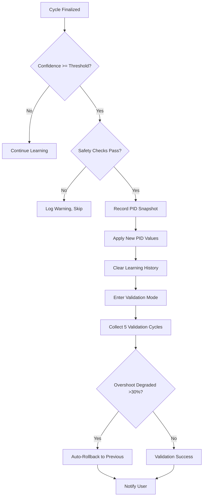
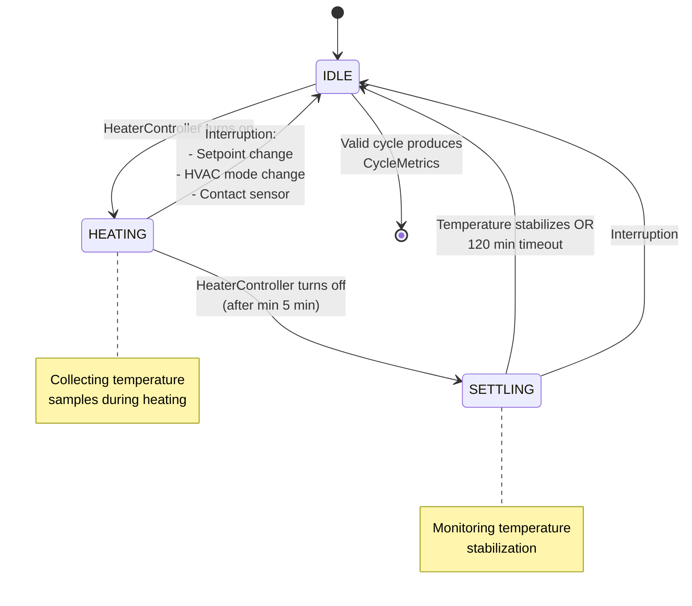
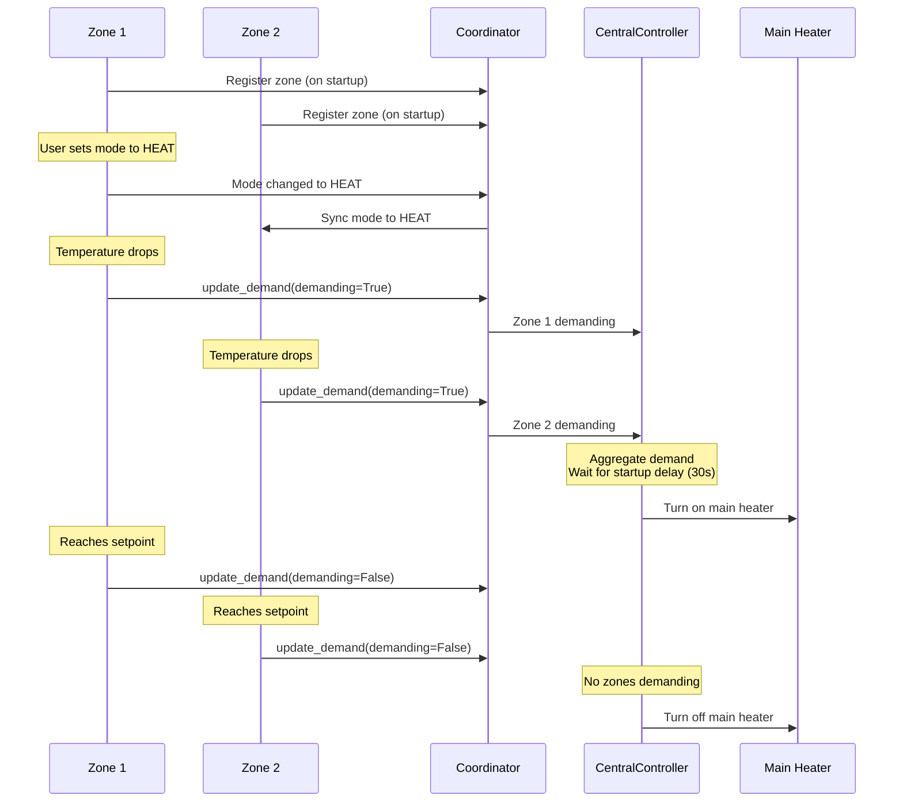
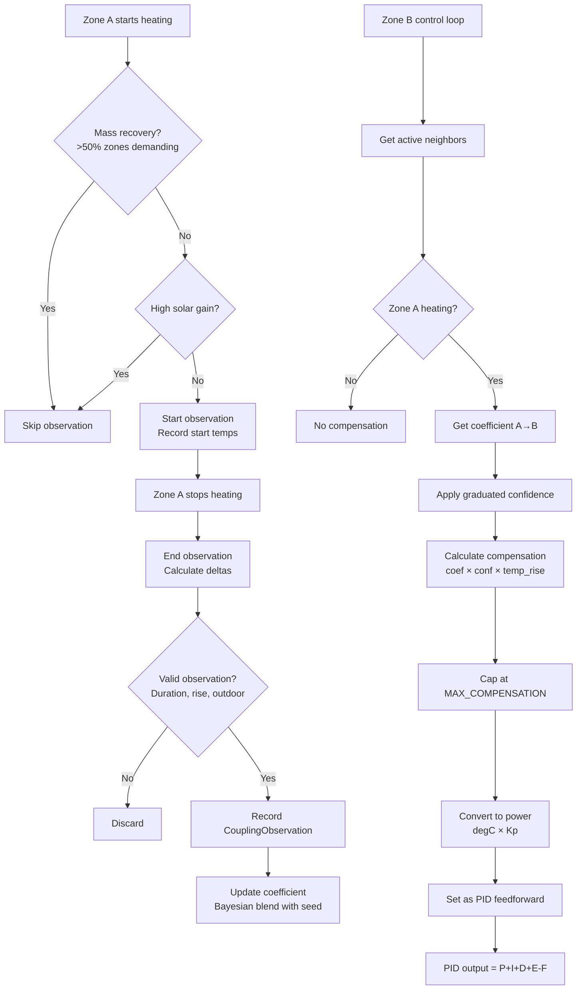

# CLAUDE.md

This file provides guidance to Claude Code (claude.ai/code) when working with code in this repository.

## Project Overview

HASmartThermostat is a Home Assistant custom component providing PID-based thermostat control with adaptive learning, multi-zone coordination, and physics-based initialization. Fork of Smart Thermostat PID with extensive enhancements.

**Key Capabilities:**
- PID temperature control with PWM modulation (on/off switches) or direct valve control (0-100%)
- Adaptive learning from heating cycles to auto-tune PID parameters
- Physics-based PID initialization using thermal properties (no manual tuning required)
- Multi-zone coordination: central heat source control, mode sync, zone linking
- Energy optimization: night setback, solar gain prediction, contact sensors, heating curves

## Development Commands

```bash
# Run all tests
pytest

# Run specific test file
pytest tests/test_pid_controller.py

# Run specific test method
pytest tests/test_physics.py::TestPhysicsCalculations::test_thermal_time_constant

# Run with coverage
pytest --cov=custom_components/adaptive_thermostat

# Run tests as CI does (verbose, short traceback)
python -m pytest tests/ -v --tb=short
```

**Installation:** Copy `custom_components/adaptive_thermostat/` to HA's `config/custom_components/`, then restart Home Assistant. No build system - pure Python loaded at runtime.

## Code Style

- **Maximum file length:** Keep files under 800 lines. When a file grows beyond this, extract logical components into separate modules.

## Architecture

### Core Modules

| Module | Purpose |
|--------|---------|
| `climate.py` | Main `SmartThermostat` entity - orchestrates managers, preset modes, state persistence |
| `coordinator.py` | `AdaptiveThermostatCoordinator` (zone registry), `CentralController` (main heat source), `ModeSync`, thermal coupling observation triggers |
| `pid_controller/__init__.py` | Pure PID with P, I, D, E (outdoor compensation), F (feedforward) terms |
| `adaptive/learning.py` | `AdaptiveLearner` - cycle analysis, overshoot/settling detection, rule-based PID adjustments |
| `adaptive/cycle_analysis.py` | `PhaseAwareOvershootTracker`, `CycleMetrics` - cycle metrics calculation and overshoot detection |
| `adaptive/physics.py` | `calculate_thermal_time_constant()`, `calculate_initial_pid()` - Ziegler-Nichols tuning |
| `sensor.py` | Performance sensors (duty cycle, power/m²), learning metrics, health monitoring |
| `services.py` | Domain and entity services (`run_learning`, `apply_adaptive_pid`, `reset_pid_to_physics`) |

### Manager Classes (`managers/`)

The control loop is refactored into specialized manager classes for separation of concerns:

| Manager | Purpose |
|---------|---------|
| `HeaterController` | Device control - on/off, valve positioning, PWM cycling, state tracking |
| `CycleTrackerManager` | Real-time cycle tracking - state machine (IDLE→HEATING→SETTLING), temperature collection, metrics calculation |
| `TemperatureManager` | Temperature state tracking and validation |
| `KeManager` | Outdoor temperature compensation (Ke parameter) tuning and convergence tracking |
| `NightSetbackManager` | Night setback scheduling with dynamic sunrise-based end time |

### Adaptive Features (`adaptive/`)

| Module | Purpose |
|--------|---------|
| `thermal_coupling.py` | `ThermalCouplingLearner` - learns heat transfer between zones for feedforward compensation |
| `night_setback.py` | Scheduled temperature reduction with dynamic sunrise-based end time |
| `solar_recovery.py` | Delays morning heating when sun will warm the zone |
| `sun_position.py` | Astral-based sun position for window illumination timing |
| `contact_sensors.py` | Pauses/frost-protects on window/door open |
| `heating_curves.py` | Outdoor temperature compensation (Ke parameter) |
| `vacation.py` | Frost protection mode with learning disabled |

### Data Flow



### Initialization Flow

The following diagram shows the order in which managers are created and initialized during startup:



### Configuration Architecture

**Two-level YAML configuration:**

1. **Domain level** (`adaptive_thermostat:`): house_energy_rating, main_heater_switch, main_cooler_switch, source_startup_delay, sync_modes, preset temperatures, energy/weather entities

2. **Climate entity level** (`climate:` - `platform: adaptive_thermostat`): heater, cooler, demand_switch, target_sensor, heating_type, area_m2, window_orientation, night_setback block, contact_sensors

**Constants** (`const.py`):
- `HEATING_TYPE_CHARACTERISTICS`: Lookup table with base PID values per heating type
- `PID_LIMITS`: Safety bounds (Kp: 10-500, Ki: 0-100, Kd: 0-200)
- `MIN_CYCLES_FOR_LEARNING`: Requires ≥3 cycles before adaptive recommendations

## Key Technical Details

### Heating Types

| Type | Description | PID Modifier | PWM Period | Reference Supply Temp |
|------|-------------|--------------|------------|----------------------|
| `floor_hydronic` | Underfloor water | 0.5x (conservative) | 15 min | 45°C |
| `radiator` | Traditional radiators | 0.7x | 10 min | 70°C |
| `convector` | Convection heaters | 1.0x (baseline) | 5 min | 55°C |
| `forced_air` | Forced air / HVAC | 1.3x (aggressive) | 3 min | 45°C |

### Supply Temperature Scaling

Optional domain-level configuration to adjust physics-based PID initialization for systems with non-standard supply temperatures (e.g., low-temperature floor heating with heat pumps).

**How it works:**
- Lower supply temperature → less heat transfer per degree → higher PID gains needed
- Scaling formula: `temp_factor = reference_ΔT / actual_ΔT` where `ΔT = supply_temp - 20°C`
- Combined with power scaling for total adjustment factor

**Configuration:**

```yaml
adaptive_thermostat:
  supply_temperature: 35  # Low-temp floor heating with heat pump
```

**Scaling Examples:**

| Heating Type | Reference | Actual Supply | Scaling Factor |
|--------------|-----------|---------------|----------------|
| `floor_hydronic` | 45°C | 35°C | 1.67x (25/15) |
| `floor_hydronic` | 45°C | 45°C | 1.0x (no change) |
| `radiator` | 70°C | 55°C | 1.43x (50/35) |
| `radiator` | 70°C | 80°C | 0.83x (50/60) |

**Validation:**
- Range: 25°C - 80°C
- Temp factor clamped to 0.5x - 2.0x for safety
- Combined power+temp scaling clamped to 0.25x - 4.0x

### Floor Construction

For `floor_hydronic` systems, you can specify floor construction details to improve thermal time constant calculations. The system uses material thermal properties and pipe spacing to calculate a `tau_modifier` that adjusts the base thermal time constant.

**Material Libraries:**

**Top Floor Materials** (11 materials with thermal properties):

| Material | Conductivity W/(m·K) | Density kg/m³ | Specific Heat J/(kg·K) |
|----------|---------------------|---------------|------------------------|
| `ceramic_tile` | 1.3 | 2300 | 840 |
| `porcelain` | 1.5 | 2400 | 880 |
| `natural_stone` | 2.8 | 2700 | 900 |
| `terrazzo` | 1.8 | 2200 | 850 |
| `polished_concrete` | 1.4 | 2100 | 880 |
| `hardwood` | 0.15 | 700 | 1600 |
| `engineered_wood` | 0.13 | 650 | 1600 |
| `laminate` | 0.17 | 800 | 1500 |
| `vinyl` | 0.19 | 1200 | 1400 |
| `carpet` | 0.06 | 200 | 1300 |
| `cork` | 0.04 | 200 | 1800 |

**Screed Materials** (7 materials with thermal properties):

| Material | Conductivity W/(m·K) | Density kg/m³ | Specific Heat J/(kg·K) |
|----------|---------------------|---------------|------------------------|
| `cement` | 1.4 | 2100 | 840 |
| `anhydrite` | 1.2 | 2000 | 1000 |
| `lightweight` | 0.47 | 1000 | 1000 |
| `mastic_asphalt` | 0.7 | 2100 | 920 |
| `synthetic` | 0.3 | 1200 | 1200 |
| `self_leveling` | 1.3 | 1900 | 900 |
| `dry_screed` | 0.2 | 800 | 1000 |

**Pipe Spacing Efficiency:**

| Spacing (mm) | Efficiency | Notes |
|--------------|-----------|-------|
| 100 | 0.92 | Tight spacing - best heat distribution |
| 150 | 0.87 | Standard spacing (default) |
| 200 | 0.80 | Wide spacing - moderate efficiency |
| 300 | 0.68 | Very wide spacing - reduced efficiency |

**YAML Configuration Example:**

```yaml
climate:
  - platform: adaptive_thermostat
    heating_type: floor_hydronic
    area_m2: 50
    floor_construction:
      pipe_spacing_mm: 150
      layers:
        - type: top_floor
          material: ceramic_tile
          thickness_mm: 10
        - type: screed
          material: cement
          thickness_mm: 50
```

**Validation Rules:**

1. **Layer Order:** Top floor layers must precede screed layers
2. **Thickness Ranges:**
   - Top floor: 5-25 mm
   - Screed: 30-80 mm
3. **Material Types:** Must exist in `TOP_FLOOR_MATERIALS` or `SCREED_MATERIALS`
4. **Pipe Spacing:** One of 100, 150, 200, 300 mm (defaults to 150 if not specified)

**Tau Modifier Calculation:**

The `tau_modifier` adjusts the base thermal time constant based on actual floor mass relative to a reference 50mm cement screed:

```
tau_modifier = (total_mass / reference_mass) / spacing_efficiency
```

Where:
- `total_mass = Σ(thickness_m × area_m2 × density × specific_heat)` for all layers
- `reference_mass = 50mm cement screed thermal mass`
- `spacing_efficiency = PIPE_SPACING_EFFICIENCY[pipe_spacing_mm]`

Example: A floor with 10mm ceramic tile + 50mm cement screed at 150mm pipe spacing:
- Total mass ≈ 1.1× reference mass (tile adds 10% thermal mass)
- Spacing efficiency = 0.87
- `tau_modifier = 1.1 / 0.87 ≈ 1.26`
- Final tau = base_tau × 1.26 (26% slower response due to added thermal mass)

Higher tau modifier = slower system response (more conservative PID tuning).

### PID Adjustment Rules (in `adaptive/learning.py`)

The adaptive learning system uses heating-type-specific thresholds for rule activation. These thresholds are derived from convergence thresholds using multipliers defined in `RULE_THRESHOLD_MULTIPLIERS`, ensuring that slow systems (high thermal mass) get proportionally relaxed criteria to match their physical characteristics.

**Rule Thresholds by Heating Type:**

| Rule | floor_hydronic | radiator | convector | forced_air | Baseline (convector) |
|------|----------------|----------|-----------|------------|----------------------|
| **Slow Response** | 120 min | 80 min | 60 min | 40 min | rise_time_max × 1.33 |
| **Moderate Overshoot** | 0.30°C | 0.25°C | 0.20°C | 0.15°C | overshoot_max × 1.0 |
| **High Overshoot** | 1.5°C | 1.2°C | 1.0°C | 1.0°C | overshoot_max × 5.0 |

**Note:** Thresholds are computed dynamically using `get_rule_thresholds(heating_type)` from `const.py`. Floor values (minimum thresholds) apply to prevent excessive sensitivity from sensor noise.

**Adjustment Actions:**

| Observation | Adjustment |
|-------------|------------|
| Overshoot > High Overshoot threshold | Reduce Kp by 15% |
| Overshoot > Moderate Overshoot threshold | Reduce Kp by 5% |
| Slow response > Slow Response threshold | Increase Kp by 10% |
| Undershoot > undershoot threshold (overshoot_max × 1.5) | Increase Ki by 20% |
| Oscillations > many_oscillations threshold (3×) | Reduce Kp 10%, increase Kd 20% |
| Slow settling > slow_settling threshold (settling_time_max × 1.5) | Increase Kd by 15% |

### Automatic PID Application (in `adaptive/learning.py` and `managers/pid_tuning.py`)

When `auto_apply_pid: true` (default), PID adjustments are applied automatically when convergence confidence reaches heating-type-specific thresholds. The system includes safety limits and a validation window to prevent runaway tuning.

**Auto-Apply Flow:**



**Safety Limits (in `const.py`):**

| Constant | Value | Purpose |
|----------|-------|---------|
| `MAX_AUTO_APPLIES_PER_SEASON` | 5 | Prevents runaway tuning within 90 days |
| `MAX_AUTO_APPLIES_LIFETIME` | 20 | Requires manual review after extensive tuning |
| `MAX_CUMULATIVE_DRIFT_PCT` | 50% | PID can't drift >1.5× from physics baseline |
| `VALIDATION_CYCLE_COUNT` | 5 | Cycles to validate new PID |
| `VALIDATION_DEGRADATION_THRESHOLD` | 30% | Overshoot increase that triggers rollback |
| `SEASONAL_SHIFT_BLOCK_DAYS` | 7 | Days blocked after large outdoor temp shift |
| `PID_HISTORY_SIZE` | 10 | Snapshots retained for rollback |

**Auto-Apply Thresholds by Heating Type:**

| Type | confidence_first | confidence_subsequent | min_cycles | cooldown_hours | cooldown_cycles |
|------|------------------|----------------------|------------|----------------|-----------------|
| `floor_hydronic` | 80% | 90% | 8 | 96h | 15 |
| `radiator` | 70% | 85% | 7 | 72h | 12 |
| `convector` | 60% | 80% | 6 | 48h | 10 |
| `forced_air` | 60% | 80% | 6 | 36h | 8 |

Slow systems require higher confidence because mistakes take longer to recover from.

**Key Methods:**

- `AdaptiveLearner.check_auto_apply_limits()` - Verifies all safety limits
- `AdaptiveLearner.start_validation_mode()` - Begins 5-cycle validation window
- `AdaptiveLearner.add_validation_cycle()` - Returns `'success'`, `'rollback'`, or `None` (collecting)
- `PIDTuningManager.async_auto_apply_adaptive_pid()` - Orchestrates the auto-apply flow
- `PIDTuningManager.async_rollback_pid()` - Reverts to previous PID from history

**Entity Attributes Exposed:**

| Attribute | Type | Description |
|-----------|------|-------------|
| `auto_apply_pid_enabled` | bool | Whether auto-apply is enabled |
| `auto_apply_count` | int | Number of times PID has been auto-applied |
| `validation_mode` | bool | Currently validating new PID values |
| `pid_history` | list | Last 3 PID configurations (timestamp, kp, ki, kd, reason) |

### Cycle Tracking State Machine

The `CycleTrackerManager` implements a three-state machine for real-time learning:

1. **IDLE**: No heating active, waiting for heater to turn on
2. **HEATING**: Heater active, collecting temperature samples
3. **SETTLING**: Heater off, monitoring temperature stabilization

**Transitions:**
- IDLE → HEATING: When `HeaterController` turns on heater
- HEATING → SETTLING: When `HeaterController` turns off heater (after min 5 min)
- SETTLING → IDLE: When temperature stabilizes OR 120 min timeout

**Interruptions:** Setpoint changes, HVAC mode changes, or contact sensor triggers may invalidate the current cycle. Interruption handling uses the `InterruptionClassifier` for consistent decision-making.

**Output:** Valid cycles produce `CycleMetrics` (with `interruption_history` for debugging) fed to `AdaptiveLearner` for PID tuning recommendations.

#### Interruption Decision Matrix

The `InterruptionClassifier` in `adaptive/cycle_analysis.py` provides standardized interruption handling:

| Interruption Type | Classification Logic | Action | Rationale |
|-------------------|---------------------|---------|-----------|
| **Setpoint Change (Major)** | ΔT > 0.5°C AND device inactive | **Abort cycle** | Large setpoint change when heater off indicates user intent change - cycle data no longer valid |
| **Setpoint Change (Minor)** | ΔT ≤ 0.5°C OR device active | **Continue tracking** | Small adjustments or changes during active heating - update target and continue |
| **Mode Change** | Incompatible mode transition | **Abort cycle** | heat→off, cool→heat, etc. terminate control - cycle invalid |
| **Mode Change (Compatible)** | heat→auto, cool→auto, etc. | **Continue tracking** | Compatible mode changes preserve control objective |
| **Contact Sensor** | Open > 300s (5 min) | **Abort cycle** | Extended window/door opening invalidates thermal model |
| **Contact Sensor (Grace)** | Open ≤ 300s | **No interruption** | Brief openings (checking mail, etc.) - cycle continues |
| **Settling Timeout** | 120 min without stabilization | **Finalize cycle** | Prevents infinite settling wait - record what we have |

**Constants:**
- `SETPOINT_MAJOR_THRESHOLD = 0.5°C` - threshold for major vs minor setpoint changes
- `CONTACT_GRACE_PERIOD = 300s` - grace period for brief contact sensor openings



### Multi-Zone Coordination

- **Mode sync**: HEAT/COOL propagates to all zones; OFF stays independent
- **Central controller**: Aggregates zone demand, startup delay (default 30s) before main heater fires
- **Thermal coupling**: Learns heat transfer between zones, applies feedforward compensation to reduce overshoot



### Thermal Coupling

The thermal coupling system automatically learns how heat transfers between adjacent zones and applies feedforward compensation to reduce overshoot when neighboring zones are heating.

**Key Modules:**

| Module | Purpose |
|--------|---------|
| `adaptive/thermal_coupling.py` | `ThermalCouplingLearner`, `CouplingObservation`, `CouplingCoefficient` - observation tracking and Bayesian coefficient calculation |
| `coordinator.py` | Observation triggers on demand transitions, solar gain detection |
| `managers/control_output.py` | Coupling compensation calculation, feedforward to PID |

**How It Works:**

1. **Observation**: When Zone A starts heating (5+ min after demand), record start temps for all idle zones
2. **Recording**: When Zone A stops heating, calculate temperature deltas for each idle zone
3. **Filtering**: Discard observations with short duration (<15 min), low source rise (<0.3°C), unstable outdoor temp (>3°C change), or target cooler than source
4. **Learning**: Bayesian blend of seed coefficients with observed transfer rates
5. **Compensation**: Predict temperature rise from neighbors, inject as feedforward to PID

**Prerequisites:**

Thermal coupling requires proper floor and area configuration in Home Assistant:
1. **Configure floors**: Settings → Areas, rooms & devices → Floors (create floors like "Ground Floor", "First Floor", etc.)
2. **Create areas**: Settings → Areas, rooms & devices → Areas (create areas and assign to floors)
3. **Assign entities**: Assign your climate entities to areas

The system will automatically discover which floor each zone is on by following the entity→area→floor registry chain.

**Configuration:**

```yaml
adaptive_thermostat:
  thermal_coupling:
    enabled: true  # default
    open:
      - climate.living_room
      - climate.kitchen
    stairwell_zones:
      - climate.hallway
      - climate.landing
    seed_coefficients:  # optional overrides
      same_floor: 0.15
      up: 0.40
      down: 0.10
      open: 0.60
      stairwell_up: 0.45
      stairwell_down: 0.10
```

**Configuration Options:**

- `enabled` (default: true) - Enable/disable thermal coupling feature
- `open` - List of entity IDs for open floor plan zones (high coupling within same floor)
- `stairwell_zones` - List of entity IDs that connect multiple floors vertically
- `seed_coefficients` - Optional overrides for default coupling seed values

**Floor Auto-Discovery:**

The system automatically determines floor assignments using Home Assistant's registry:
- Queries entity registry for each climate entity
- Follows entity → area → floor relationship
- Zones without area assignment or floor assignment are excluded from thermal coupling
- Generates seed coefficients based on discovered floor relationships (same floor, up, down)
- Applies `open` modifier to zones in the open list that are on the same floor

**Seed Coefficients (default values):**

| Type | Value | Description |
|------|-------|-------------|
| `same_floor` | 0.15 | Adjacent zones on same floor |
| `up` | 0.40 | Heat rising to floor above |
| `down` | 0.10 | Heat transfer to floor below |
| `open` | 0.60 | Open floor plan (high coupling) |
| `stairwell_up` | 0.45 | Stairwell acting as heat chimney |
| `stairwell_down` | 0.10 | Stairwell downward (minimal) |

**Maximum Coupling Compensation by Heating Type:**

| Type | Max Compensation | Rationale |
|------|------------------|-----------|
| `floor_hydronic` | 1.0°C | Conservative - slow response, can't recover quickly |
| `radiator` | 1.2°C | Moderate |
| `convector` | 1.5°C | Standard |
| `forced_air` | 2.0°C | Aggressive - fast recovery if over-compensated |

**Learner Constants:**

| Constant | Value | Purpose |
|----------|-------|---------|
| `COUPLING_MIN_OBSERVATIONS` | 3 | Min observations before using learned coefficient |
| `COUPLING_SEED_WEIGHT` | 6 | Weight of seed in Bayesian blend (pseudo-observations) |
| `COUPLING_MAX_COEFFICIENT` | 0.5 | Maximum allowed coupling coefficient |
| `COUPLING_MIN_DURATION_MINUTES` | 15 | Minimum heating duration for valid observation |
| `COUPLING_MIN_SOURCE_RISE` | 0.3°C | Minimum source temp rise for valid observation |
| `COUPLING_MAX_OUTDOOR_CHANGE` | 3.0°C | Max outdoor temp change during observation |
| `COUPLING_CONFIDENCE_THRESHOLD` | 0.3 | Min confidence to apply compensation |
| `COUPLING_CONFIDENCE_MAX` | 0.5 | Confidence level for full effect |
| `COUPLING_VALIDATION_CYCLES` | 5 | Cycles to validate coefficient after change |
| `COUPLING_VALIDATION_DEGRADATION` | 30% | Overshoot increase threshold for rollback |

**Coupling Compensation Data Flow:**



**Entity Attributes Exposed:**

| Attribute | Type | Description |
|-----------|------|-------------|
| `coupling_coefficients` | dict | Source zone → coefficient value for this zone |
| `coupling_compensation` | float | Current °C compensation being applied |
| `coupling_compensation_power` | float | Current power % reduction from feedforward |
| `coupling_observations_pending` | int | Count of active observation contexts |
| `coupling_learner_state` | str | "learning" / "validating" / "stable" |

**Validation and Rollback:**

When a coefficient is updated, the system enters validation mode for 5 cycles. If overshoot increases by more than 30% compared to baseline, the coefficient is automatically halved (rolled back). This prevents over-aggressive compensation from causing undershoot.

### Persistence

Learning data (AdaptiveLearner cycle history, KeLearner observations, thermal coupling) persists across Home Assistant restarts using the `LearningDataStore` class in `adaptive/persistence.py`.

**Storage Format (v4 - zone-keyed with thermal coupling):**

```json
{
  "version": 4,
  "zones": {
    "climate.living_room": {
      "adaptive_learner": {
        "cycle_history": [
          {"overshoot": 0.3, "undershoot": 0.1, "settling_time": 45.0, ...}
        ],
        "consecutive_converged_cycles": 3,
        "pid_converged_for_ke": true,
        "auto_apply_count": 1
      },
      "ke_learner": {
        "current_ke": 0.55,
        "observations": [...],
        "enabled": true
      },
      "last_updated": "2025-01-14T10:30:00"
    }
  },
  "thermal_coupling": {
    "observations": {
      "climate.zone_a|climate.zone_b": [
        {"timestamp": "2025-01-14T10:00:00", "source_temp_start": 20.0, ...}
      ]
    },
    "coefficients": {
      "climate.zone_a|climate.zone_b": {
        "coefficient": 0.25, "confidence": 0.45, "observation_count": 5, ...
      }
    },
    "seeds": {
      "climate.zone_a|climate.zone_b": 0.15
    }
  }
}
```

**Key Classes:**
- `LearningDataStore` - Singleton managing HA Store helper, zone-keyed storage
- `AdaptiveLearner.to_dict()` / `restore_from_dict()` - Serialization/deserialization
- `KeLearner.to_dict()` / `from_dict()` - Serialization/deserialization

**Persistence Flow:**

```mermaid
flowchart TD
    subgraph Startup
        A[async_setup_platform] --> B{learning_store exists?}
        B -->|No| C[Create LearningDataStore]
        C --> D[async_load from HA Store]
        B -->|Yes| D
        D --> E[get_zone_data for zone]
        E --> F{zone data exists?}
        F -->|Yes| G[AdaptiveLearner.restore_from_dict]
        F -->|No| H[Use physics-based defaults]
        G --> I[async_added_to_hass]
        H --> I
        I --> J{stored_ke_data exists?}
        J -->|Yes| K[KeLearner.from_dict]
        J -->|No| L[Physics-based Ke init]
        K --> M[CycleTrackerManager.set_restoration_complete]
        L --> M
    end

    subgraph Runtime
        N[Cycle finalized] --> O[AdaptiveLearner.add_cycle_metrics]
        O --> P[update_zone_data in memory]
        P --> Q[schedule_zone_save - 30s debounce]
    end

    subgraph Shutdown
        R[async_will_remove_from_hass] --> S[async_save_zone]
        S --> T[Immediate save to HA Store]
    end
```



**Key Implementation Details:**
- Uses Home Assistant's `Store` helper for atomic writes and versioning
- Zone-keyed storage allows independent save/restore per thermostat entity
- `schedule_zone_save()` uses 30-second debounce to batch frequent cycle completions
- `async_save_zone()` with `asyncio.Lock` prevents race conditions
- Migration support: v2 (flat) → v3 (zone-keyed) → v4 (thermal coupling) automatic conversion
- Restoration gating: `CycleTrackerManager` ignores temperature updates until `set_restoration_complete()` is called to prevent false cycles during startup

## Important Caveats

**Service calls:** Always use `hass.services.async_call()` - never directly manipulate entity states.

**PWM vs Valve control:**
- PWM mode (`pwm > "00:00:00"`): On/off cycling for switches
- Valve mode (`pwm: 0` or omitted): Direct 0-100% positioning

**State persistence:** Inherits from `RestoreEntity` - PID integral term and gains persist across restarts.

**Outdoor temperature compensation (Ke):** Start with 0.3-0.6 for well-insulated buildings. Acts like integral term with faster response.

**Integral clamping with external term (v0.7.0+):** The PID controller uses the formula `I_max = out_max - E` and `I_min = out_min - E` to ensure the total output `P + I + D + E` respects the configured bounds. After the v0.7.0 Ke reduction (100x smaller values), the external term typically contributes <1% of the output range, leaving >99% headroom for the integral term to accumulate. This resolves the pre-v0.7.0 issue where large Ke values (0.1-1.3) would steal 10-50% of the integral headroom, causing underheating in extreme cold conditions.

## Test Organization

Tests are organized by component - run the relevant file when modifying:

| Test File | Tests |
|-----------|-------|
| `test_pid_controller.py` | PID math |
| `test_physics.py` | Thermal calculations |
| `test_learning.py` | Adaptive tuning rules |
| `test_cycle_tracker.py` | Cycle tracking state machine |
| `test_integration_cycle_learning.py` | End-to-end cycle tracking and learning flow |
| `test_coordinator.py` | Multi-zone coordination |
| `test_central_controller.py` | Main heat source control |
| `test_mode_sync.py` | Mode synchronization |
| `test_thermal_coupling.py` | Thermal coupling dataclasses and learner |
| `test_coupling_integration.py` | End-to-end thermal coupling flow |
| `test_control_output.py` | Control output manager and coupling compensation |
| `test_climate_config.py` | Climate config parsing and coupling initialization |
| `test_night_setback.py` | Schedule & dynamic end time |
| `test_solar_recovery.py` | Solar delay logic |
| `test_sun_position.py` | Astral calculations |
| `test_contact_sensors.py` | Window/door handling |
