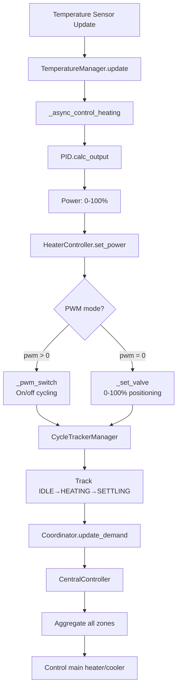
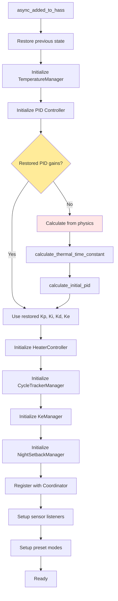
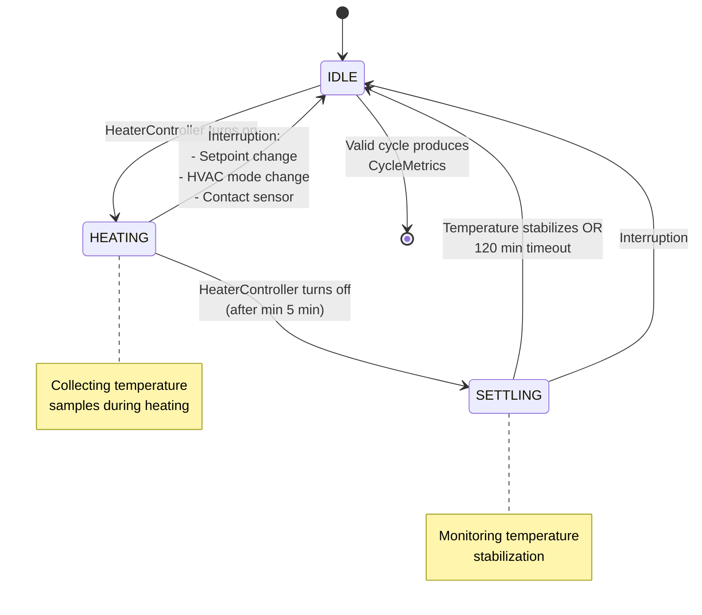
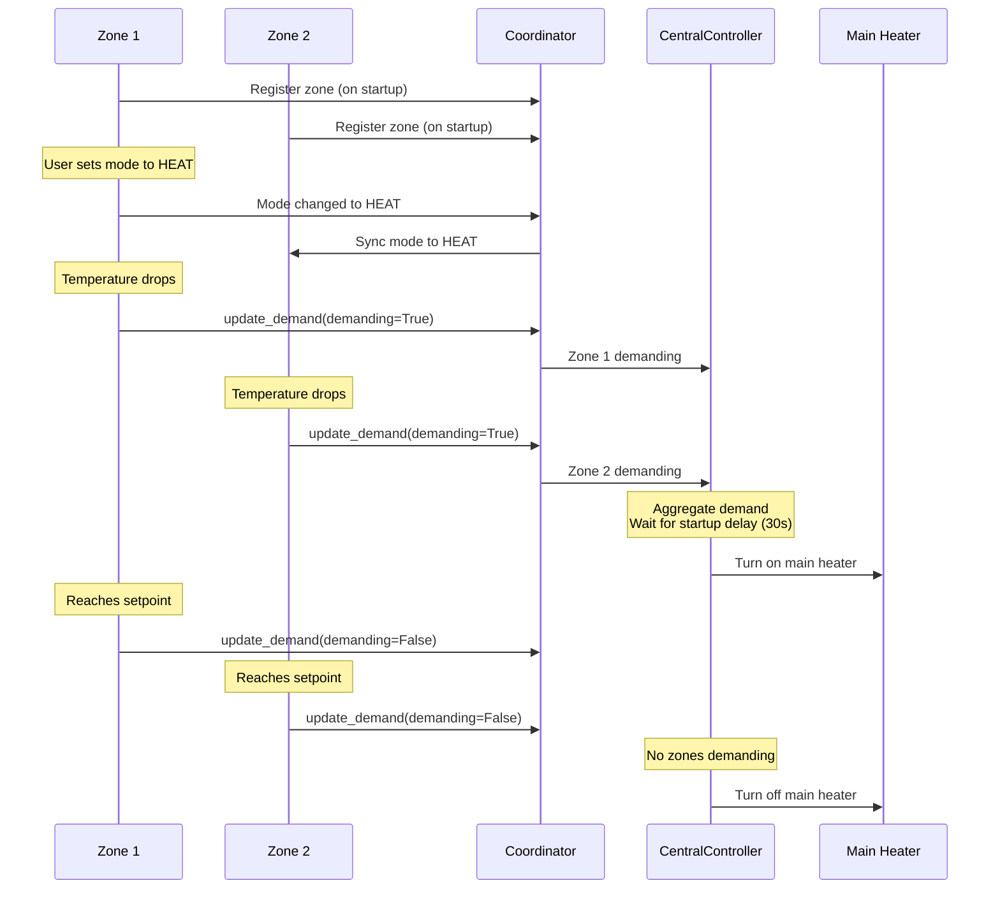

# CLAUDE.md

This file provides guidance to Claude Code (claude.ai/code) when working with code in this repository.

## Project Overview

HASmartThermostat is a Home Assistant custom component providing PID-based thermostat control with adaptive learning, multi-zone coordination, and physics-based initialization. Fork of Smart Thermostat PID with extensive enhancements.

**Key Capabilities:**
- PID temperature control with PWM modulation (on/off switches) or direct valve control (0-100%)
- Adaptive learning from heating cycles to auto-tune PID parameters
- Physics-based PID initialization using thermal properties (no manual tuning required)
- Multi-zone coordination: central heat source control, mode sync, zone linking
- Energy optimization: night setback, solar gain prediction, contact sensors, heating curves

## Development Commands

```bash
# Run all tests
pytest

# Run specific test file
pytest tests/test_pid_controller.py

# Run specific test method
pytest tests/test_physics.py::TestPhysicsCalculations::test_thermal_time_constant

# Run with coverage
pytest --cov=custom_components/adaptive_thermostat

# Run tests as CI does (verbose, short traceback)
python -m pytest tests/ -v --tb=short
```

**Installation:** Copy `custom_components/adaptive_thermostat/` to HA's `config/custom_components/`, then restart Home Assistant. No build system - pure Python loaded at runtime.

## Code Style

- **Maximum file length:** Keep files under 800 lines. When a file grows beyond this, extract logical components into separate modules.

## Architecture

### Core Modules

| Module | Purpose |
|--------|---------|
| `climate.py` | Main `SmartThermostat` entity - orchestrates managers, preset modes, state persistence |
| `coordinator.py` | `AdaptiveThermostatCoordinator` (zone registry), `CentralController` (main heat source), `ModeSync`, `ZoneLinker` |
| `pid_controller/__init__.py` | Pure PID with P, I, D, E (outdoor compensation) terms |
| `adaptive/learning.py` | `AdaptiveLearner` - cycle analysis, overshoot/settling detection, rule-based PID adjustments |
| `adaptive/cycle_analysis.py` | `PhaseAwareOvershootTracker`, `CycleMetrics` - cycle metrics calculation and overshoot detection |
| `adaptive/physics.py` | `calculate_thermal_time_constant()`, `calculate_initial_pid()` - Ziegler-Nichols tuning |
| `sensor.py` | Performance sensors (duty cycle, power/m²), learning metrics, health monitoring |
| `services.py` | Domain and entity services (`run_learning`, `apply_adaptive_pid`, `reset_pid_to_physics`) |

### Manager Classes (`managers/`)

The control loop is refactored into specialized manager classes for separation of concerns:

| Manager | Purpose |
|---------|---------|
| `HeaterController` | Device control - on/off, valve positioning, PWM cycling, state tracking |
| `CycleTrackerManager` | Real-time cycle tracking - state machine (IDLE→HEATING→SETTLING), temperature collection, metrics calculation |
| `TemperatureManager` | Temperature state tracking and validation |
| `KeManager` | Outdoor temperature compensation (Ke parameter) tuning and convergence tracking |
| `NightSetbackManager` | Night setback scheduling with dynamic sunrise-based end time |

### Adaptive Features (`adaptive/`)

| Module | Purpose |
|--------|---------|
| `night_setback.py` | Scheduled temperature reduction with dynamic sunrise-based end time |
| `solar_recovery.py` | Delays morning heating when sun will warm the zone |
| `sun_position.py` | Astral-based sun position for window illumination timing |
| `contact_sensors.py` | Pauses/frost-protects on window/door open |
| `heating_curves.py` | Outdoor temperature compensation (Ke parameter) |
| `vacation.py` | Frost protection mode with learning disabled |

### Data Flow



### Initialization Flow

The following diagram shows the order in which managers are created and initialized during startup:



### Configuration Architecture

**Two-level YAML configuration:**

1. **Domain level** (`adaptive_thermostat:`): house_energy_rating, main_heater_switch, main_cooler_switch, source_startup_delay, sync_modes, preset temperatures, energy/weather entities

2. **Climate entity level** (`climate:` - `platform: adaptive_thermostat`): heater, cooler, demand_switch, target_sensor, heating_type, area_m2, window_orientation, night_setback block, contact_sensors, linked_zones

**Constants** (`const.py`):
- `HEATING_TYPE_CHARACTERISTICS`: Lookup table with base PID values per heating type
- `PID_LIMITS`: Safety bounds (Kp: 10-500, Ki: 0-100, Kd: 0-200)
- `MIN_CYCLES_FOR_LEARNING`: Requires ≥3 cycles before adaptive recommendations

## Key Technical Details

### Heating Types

| Type | Description | PID Modifier | PWM Period |
|------|-------------|--------------|------------|
| `floor_hydronic` | Underfloor water | 0.5x (conservative) | 15 min |
| `radiator` | Traditional radiators | 0.7x | 10 min |
| `convector` | Convection heaters | 1.0x (baseline) | 5 min |
| `forced_air` | Forced air / HVAC | 1.3x (aggressive) | 3 min |

### PID Adjustment Rules (in `adaptive/learning.py`)

| Observation | Adjustment |
|-------------|------------|
| Overshoot >0.5°C | Reduce Kp by 15% |
| Overshoot >0.2°C | Reduce Kp by 5% |
| Slow response >60 min | Increase Kp by 10% |
| Undershoot >0.3°C | Increase Ki by 20% |
| Oscillations >3 | Reduce Kp 10%, increase Kd 20% |
| Slow settling >90 min | Increase Kd by 15% |

### Proportional-on-Measurement (P-on-M)

The PID controller supports two modes for the proportional term:

**Proportional-on-Error (P-on-E)** - Traditional PID behavior:
- Proportional term: `P = Kp × error` where `error = setpoint - measurement`
- **Pros:** Immediate response to setpoint changes, faster initial recovery
- **Cons:** Large output spike when setpoint changes, integral reset required
- **Use case:** Systems requiring aggressive setpoint tracking

**Proportional-on-Measurement (P-on-M)** - Derivative-like proportional (default):
- Proportional term: `P = -Kp × (measurement - last_measurement)`
- **Pros:** No output spike on setpoint changes, integral preserved across setpoint changes, smoother control
- **Cons:** Slower initial response to setpoint changes (relies on integral for recovery)
- **Use case:** Comfort-focused applications where smooth transitions matter (thermostats)

**Configuration:**
```yaml
climate:
  - platform: adaptive_thermostat
    proportional_on_measurement: true  # Default: true (P-on-M)
```

**Trade-offs:**
- P-on-M is **recommended for thermostats** to avoid temperature spikes when users adjust setpoints
- P-on-M relies more heavily on the integral term for setpoint tracking
- With P-on-M, the controller maintains smoother output during manual setpoint adjustments
- P-on-E may converge faster but at the cost of comfort during transitions

### Cycle Tracking State Machine

The `CycleTrackerManager` implements a three-state machine for real-time learning:

1. **IDLE**: No heating active, waiting for heater to turn on
2. **HEATING**: Heater active, collecting temperature samples
3. **SETTLING**: Heater off, monitoring temperature stabilization

**Transitions:**
- IDLE → HEATING: When `HeaterController` turns on heater
- HEATING → SETTLING: When `HeaterController` turns off heater (after min 5 min)
- SETTLING → IDLE: When temperature stabilizes OR 120 min timeout

**Interruptions:** Setpoint changes, HVAC mode changes, or contact sensor triggers invalidate the current cycle and reset to IDLE.

**Output:** Valid cycles produce `CycleMetrics` fed to `AdaptiveLearner` for PID tuning recommendations.



### Multi-Zone Coordination

- **Mode sync**: HEAT/COOL propagates to all zones; OFF stays independent
- **Central controller**: Aggregates zone demand, startup delay (default 30s) before main heater fires
- **Zone linking**: Delays heating in linked zones when neighbors are heating (default 20 min)



## Important Caveats

**Service calls:** Always use `hass.services.async_call()` - never directly manipulate entity states.

**PWM vs Valve control:**
- PWM mode (`pwm > "00:00:00"`): On/off cycling for switches
- Valve mode (`pwm: 0` or omitted): Direct 0-100% positioning

**State persistence:** Inherits from `RestoreEntity` - PID integral term and gains persist across restarts.

**Outdoor temperature compensation (Ke):** Start with 0.3-0.6 for well-insulated buildings. Acts like integral term with faster response.

## Test Organization

Tests are organized by component - run the relevant file when modifying:

| Test File | Tests |
|-----------|-------|
| `test_pid_controller.py` | PID math |
| `test_physics.py` | Thermal calculations |
| `test_learning.py` | Adaptive tuning rules |
| `test_cycle_tracker.py` | Cycle tracking state machine |
| `test_integration_cycle_learning.py` | End-to-end cycle tracking and learning flow |
| `test_coordinator.py` | Multi-zone coordination |
| `test_central_controller.py` | Main heat source control |
| `test_mode_sync.py` | Mode synchronization |
| `test_zone_linking.py` | Thermal coupling |
| `test_night_setback.py` | Schedule & dynamic end time |
| `test_solar_recovery.py` | Solar delay logic |
| `test_sun_position.py` | Astral calculations |
| `test_contact_sensors.py` | Window/door handling |
